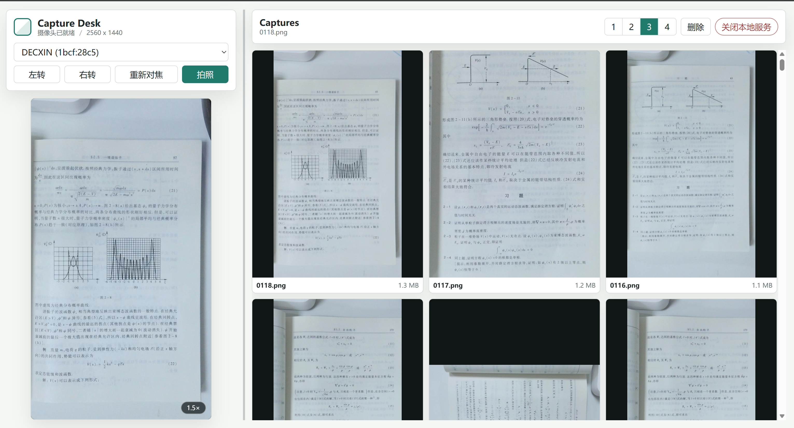

# PaperCam

Turn a USB camera into a simple local document camera and capture desk.



**[Watch the 17-second demo video](demo.mp4)**

PaperCam runs entirely on your Windows PC. It shows a live camera view, saves photos locally, and keeps recent captures beside the preview.

## What It Does

- Live document-camera preview with zoom, rotation, and refocus
- One-click capture to numbered PNG files
- Built-in gallery for viewing, downloading, dragging, and deleting images
- Simple crop, line, arrow, and text tools
- No cloud service and no external dependencies

## Quick Start

Requirements: Windows 11, Node.js, a Chromium-based browser, and a connected camera.

Double-click:

```text
start-camera-optimized.cmd
```

Or run:

```powershell
npm start
```

Then open [http://127.0.0.1:5173](http://127.0.0.1:5173) and allow camera access.

Captured images are saved in the local `captures/` folder. Use **Close local server** in the app when finished.

## Basic Controls

| Action | Control |
| --- | --- |
| Take a photo | Click the preview or **Capture** |
| Change resolution | Hover over the preview and press `1`, `2`, `3`, or `4` |
| Zoom | Use the mouse wheel over the preview |
| Move a zoomed view | Middle-drag the preview |
| Rotate | Use the left/right rotate buttons |
| Refocus | Click **Refocus** |

Available resolutions and refocus support depend on the camera and its driver.

## Privacy

PaperCam listens only on `127.0.0.1`. Camera frames and captured images stay on the local computer. The repository excludes captures, generated documents, logs, screenshots, archives, local configuration, and common secret files.

